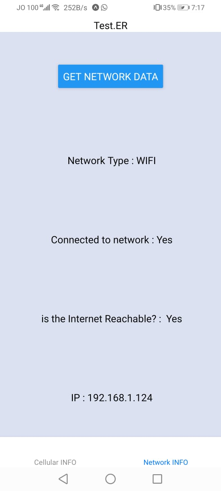

# Lab Class:41 (test.ER)

## Author: Mohammad Quthama

- [Code](https://github.com/mohammad-qethama/amman-js-401d9-class-41/tree/main)
- [master-deployment](https://expo.io/@mohammadquthama/app)

## Introduction

test.Er is an application that displays some information about your phone that might be help full to you.

## How to use

1. install expo on your Android/IOS mobile device and scan the QR code in the master deployment
2. if you want to run it locally clone/download the code from the repo `Code` and run `yarn add` code the `yarn start` then follow the instruction that will be shown to you
3. application interface have two tabs that will be shown down below
4. first tab is the cellular data click in the button to show hide your cellular network information.
5. second tab is network information click on the button to obtain/update you current network connection.

## APP interface ScreenShots

### NOTES

1. IP in the network state is your local ip not your puplic one

2. if any information is not obtainable then the corresponding filed of that info will be `N/A`.

3. i recommend using the deployment link to use the app not the local code way. 

4. **Have Fun**